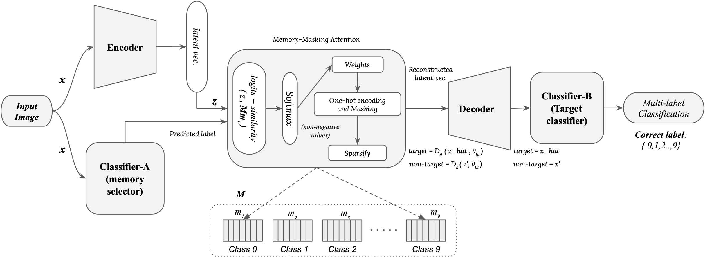

# Memory Defense: More Robust Classificationvia a Memory-Masking Autoencoder
<p align="left""><b>Authors:</b><br/>- Eashan Adhikarla<br/>- Dan Luo<br/>- Dr. Brian D. Davison</p>

<p align="center">
  
  <!--  -->
</p>

## Abstract
Many deep neural networks are susceptible to minute perturbations of images that have been carefully crafted to cause misclassification. Ideally, a robust classifier would be immune to small variations in input images, and a number of defensive approaches have been created as a result. One method would be to discern a latent representation which could ignore small changes to the input. However, typical autoencoders easily mingle inter-class latent representations when there are strong similarities between classes, making it harder for a decoder to accurately project the image back to the original high-dimensional space. We propose a novel framework, Memory Defense, an augmented classifier with a memory-masking autoencoder to counter this challenge. By masking other classes, the autoencoder learns class-specific independent latent representations. We test the model's robustness against four widely used attacks. Experiments on the Fashion-MNIST \& CIFAR-10 datasets demonstrate the superiority of our model. We make available our source code at GitHub repository: [https://github.com/eashanadhikarla/MemoryDef](https://github.com/eashanadhikarla/MemoryDef)

## Pipeline
<p align="center">
  
  <!--  -->
</p>

## Citation
If you use this repo or find it useful, please consider citing:
```

```